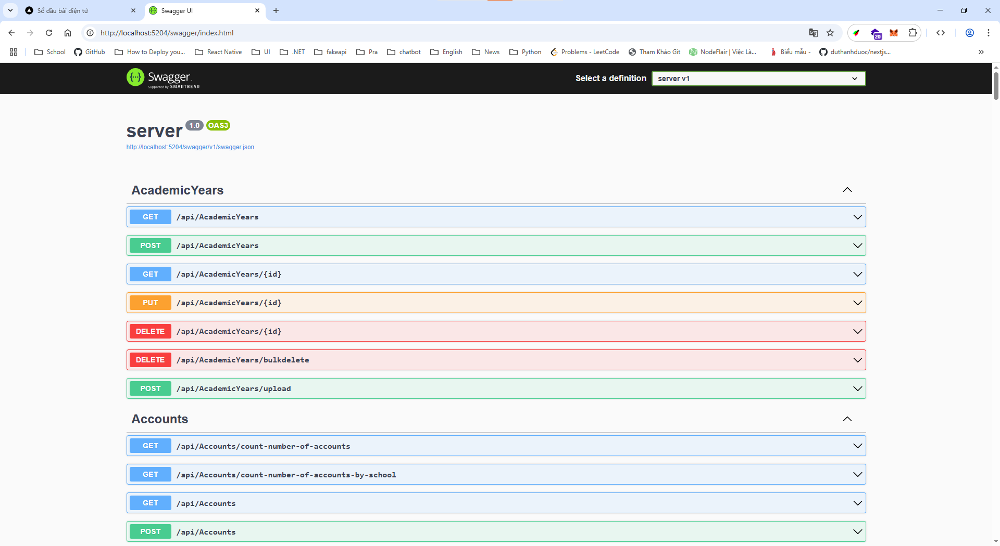
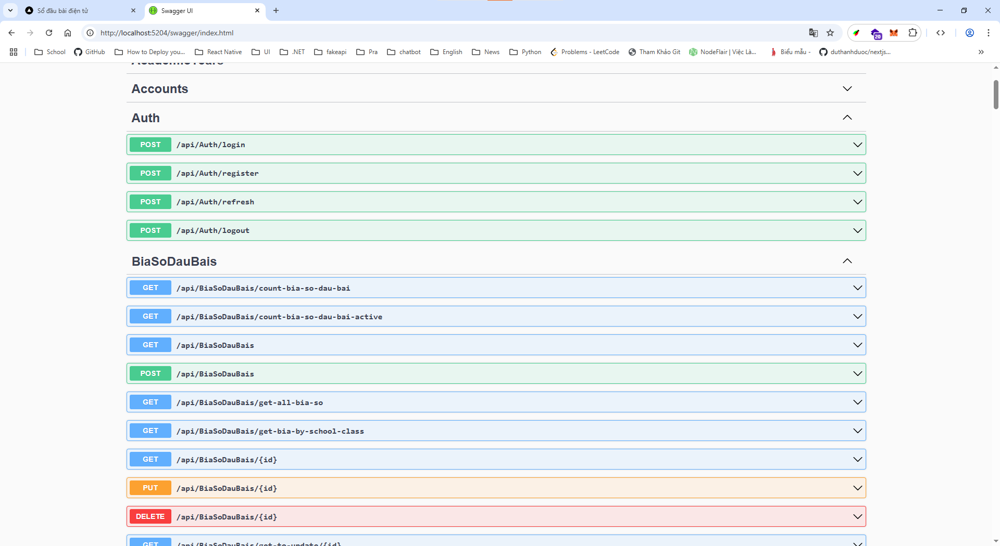
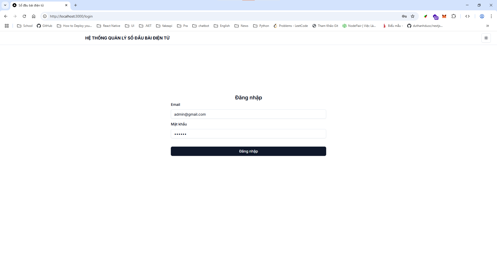
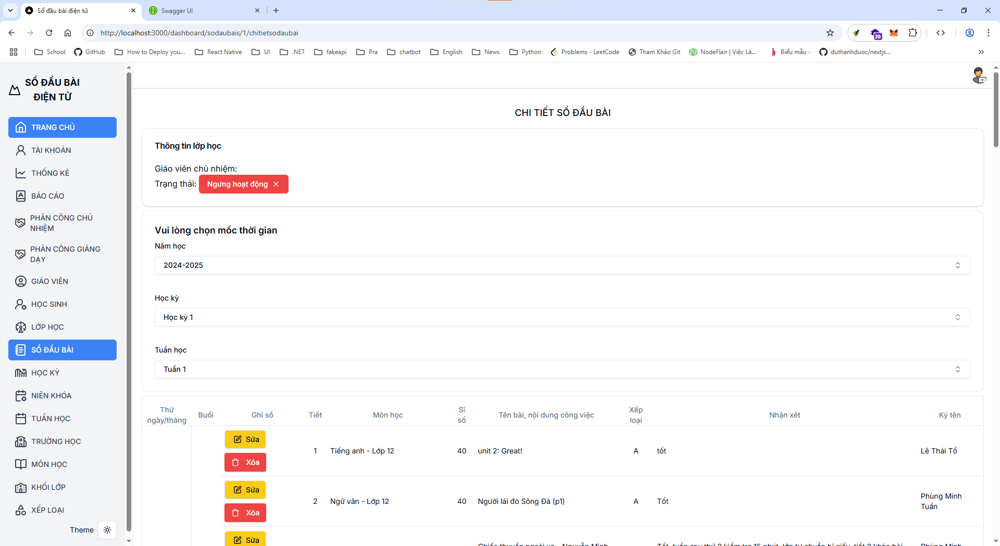
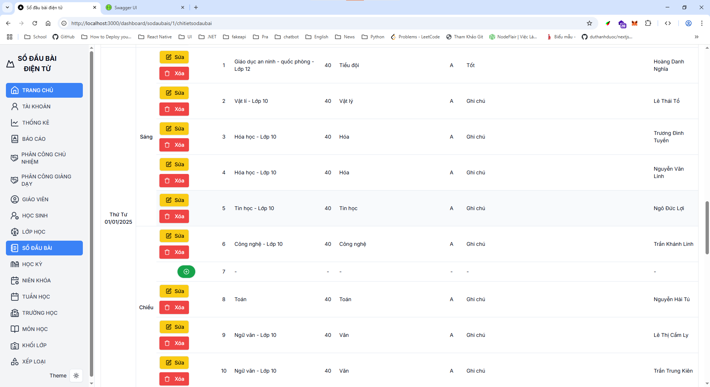
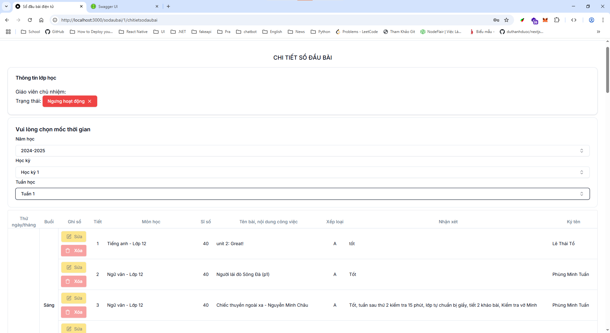
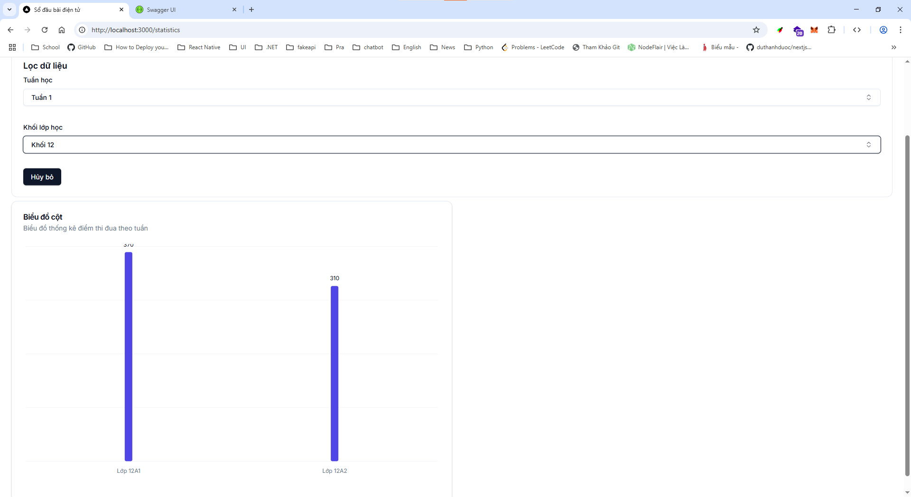

# 📘 SỔ ĐẦU BÀI - Quản lý sổ đầu bài điện tử

> Website khắc phục những bất lợi so với việc sử dụng sổ đầu bài giấy như các tình trạng sổ bị lạc mất, bị ướt, lớp trưởng quên lấy sổ, đặc biệt website hỗ trợ giáo viên ghi sổ và chỉnh sửa ngay lập tức chỉ với thiết bị điện thoại.

## 🧠 Mục đích

- Giúp nhà trường quản lý sổ đầu bài thông qua Website.
- Hiệu trưởng có thể theo dõi tình trạng giảng dạy, đánh giá nhanh các tiết học của tất cả các lớp.
- Giáo viên sử dụng các thiết bị điện tử như điện thoại, tablet, laptop để tạo mới và chỉnh sửa thông tin tiết học mà không cần di chuyển đến lớp.
- Ghi nhận chủ đề bài học, đánh giá tiến trình theo ngày, tuần giúp giáo viên và nhà trường nắm bắt hiệu quả giảng dạy.

## 🖥️ Giao diện người dùng

Frontend được phát triển với **Next.js** và sử dụng thư viện giao diện hiện đại **Shadcn UI**, mang lại trải nghiệm mượt mà, nhanh chóng và tối ưu trên nhiều thiết bị.

## 🔧 Công nghệ sử dụng

### Front-end

- **Next.js** (React-based framework)
- **Shadcn UI** (UI components)

### Back-end

- **ASP.NET Core Web API**
- **RESTful API**
- **SQL Server** làm hệ quản trị cơ sở dữ liệu

### Kiến trúc phần mềm

- **Repository Pattern**: Được áp dụng để làm lớp trung gian giữa tầng Business Logic và Data Access, giúp việc truy cập dữ liệu chặt chẽ hơn, dễ bảo trì và mở rộng.

## 🚀 Tính năng nổi bật

- 📆 Ghi chép, chỉnh sửa tiết học theo tuần/ngày.
- 👨‍🏫 Giáo viên thao tác dễ dàng trên điện thoại.
- 🏫 Hiệu trưởng và nhà trường theo dõi tiến độ giảng dạy toàn trường.
- 🔒 Bảo mật, phân quyền người dùng theo vai trò: giáo viên, quản trị, hiệu trưởng.
- 📊 Thống kê tổng quan tiết học theo tuần/lớp.

## 📸 Demo giao diện

_Back-end_

_Test API Back-end_

_Front-end_
_Hình ảnh Login_

_Hình ảnh ADMIN layout..._

> Chi tiết sổ đầu bài
>  > 

_Hình ảnh Teacher layout..._

> Chi tiết sổ đầu bài
>  > 

> Thống kê điểm tuần học theo tuần
> 

## 📂 Cài đặt & triển khai

> Hướng dẫn chi tiết sẽ được cập nhật sớm tại đây cho cả Backend và Frontend.
> client-next: yarn dev
> server: dotnet watch run

## 💡 Đóng góp

Chúng tôi luôn chào đón các ý kiến đóng góp và pull request từ cộng đồng để phát triển dự án tốt hơn!
